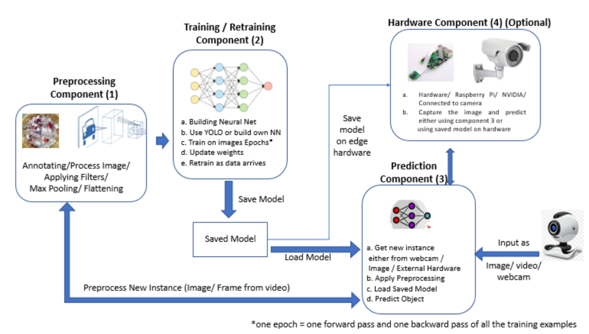

# Medical-Wate-Object-Detection-Using-YOLO
The model identifies the 8 different medical waste objects includes syringe, blooded cotton, vial, IV tubes etc. The training is done using YOLO v2 on 1500+ images.


## Introduction
It is every individual’s desire to have their home as well as vicinity clean and tidy.
It creates a fresh aura in the surroundings which enables a healthy and hygienic of living.
People dump all types of garbage including medical waste anywhere in the city without
proper segregation, which is not environment friendly. However, this illegal dumping can
also include hazardous waste which poses a big threat to the surroundings, such as
introducing health issues. Our system proposes the method to detect the medical waste
using object detection model YOLOv2. This System is user friendly and implicit in
nature. It will improve the detection and sorting of the medical waste easily. The system
generates appropriate responses relative to the input waste there by making it interactive
and efficient.
The camera captures image of the object to be thrown, if it is not a medical waste
then the system will notify the end user by ringing alarm in max 3 sec. Because the
system suggests that the dustbin is specifically meant for medical waste.

## High Level Architecture


### Data Training Statistics

```markdown
1. Statistics of Objects onsidered for training :
    SYRINGE: 591
    SALINE: 311
    BANDAGE: 808
    VIAL: 458
    GLOVES: 276
    IV-TUBE: 274
    MASK: 99
    COTTON: 367
    SURGICAL-GOWN: 2
    Dataset size: 1541
    Dataset of 1541 instance(s)
    
2. Training statistics: 
    Learning rate : 1e-05
    Batch size    : 16
    Epoch number  : 500
    Backup every  : 2000
    
Source | Train  | Layer description                | (?, 416, 416, 3)
 Load  |  Yep!  | conv 3x3p1_1  +bnorm  leaky      | (?, 416, 416, 16)
 Load  |  Yep!  | maxp 2x2p0_2                     | (?, 208, 208, 16)
 Load  |  Yep!  | conv 3x3p1_1  +bnorm  leaky      | (?, 208, 208, 32)
 Load  |  Yep!  | maxp 2x2p0_2                     | (?, 104, 104, 32)
 Load  |  Yep!  | conv 3x3p1_1  +bnorm  leaky      | (?, 104, 104, 64)
 Load  |  Yep!  | maxp 2x2p0_2                     | (?, 52, 52, 64)
 Load  |  Yep!  | conv 3x3p1_1  +bnorm  leaky      | (?, 52, 52, 128)
 Load  |  Yep!  | maxp 2x2p0_2                     | (?, 26, 26, 128)
 Load  |  Yep!  | conv 3x3p1_1  +bnorm  leaky      | (?, 26, 26, 256)
 Load  |  Yep!  | maxp 2x2p0_2                     | (?, 13, 13, 256)
 Load  |  Yep!  | conv 3x3p1_1  +bnorm  leaky      | (?, 13, 13, 512)
 Load  |  Yep!  | maxp 2x2p0_1                     | (?, 13, 13, 512)
 Load  |  Yep!  | conv 3x3p1_1  +bnorm  leaky      | (?, 13, 13, 1024)
 Load  |  Yep!  | conv 3x3p1_1  +bnorm  leaky      | (?, 13, 13, 1024)
 Init  |  Yep!  | conv 1x1p0_1    linear           | (?, 13, 13, 70)
-------+--------+----------------------------------+---------------

step 1 - loss 119.55308532714844 - moving ave loss 119.55308532714844
step 2 - loss 117.88551330566406 - moving ave loss 119.386328125
.
.
Finish 42 epoch(es)
step 3148 - loss 4.436044216156006 - moving ave loss 3.734053412779501
step 3149 - loss 2.905003547668457 - moving ave loss 3.651148426268397

```


## Self trained Dataset Examples


## References

- [1] Joseph Redmon, Ali Farhadi, “YOLOv3: An Increamental Improvement” Published by University of
Washington(March, 2018)
- [2] Akshay Dabholkar, Bhushan Muthiyan, “Smart Illegal Dumping Detection” Published by IEEE(June,2017)
- [3] Praveen Mathur, Sangeeta Pata and Anand S. Shobhawat, “Need of Biomedical Waste Management
Systems in Hospitals – An Emerging Issue – A review” Published by CEET(2008)
- [4] Govt. of India, Ministry of Environment and Forests Gazette notification No 460 dated July 27, New Delhi: 1998: 10-20
- [5] Rahele Tabasi, Govindan Marthandan, “Clinical Waste Management: A Review on Important Factors
in Clinical Waste Generation Rate” Published by International Journal of Science and
Technology(IJST) (2013)
- [6] Shobhit Khandare, Sunil Badak, Yugandhara Sawant, Sadiya Solkar, “Object Detection based
Garbage Collection Robot(E-Swachh)” Published by International Research Journal of Engineering
and Technology(IRJET)(March, 2018)

## Developer Info
- Manjunath C Bagewadi
- Email : manjunathsept11@gmail.com
- Ph: 9742896702
- Linked In : linkedin.com/in/manjunath-bagewadi-9325ab55